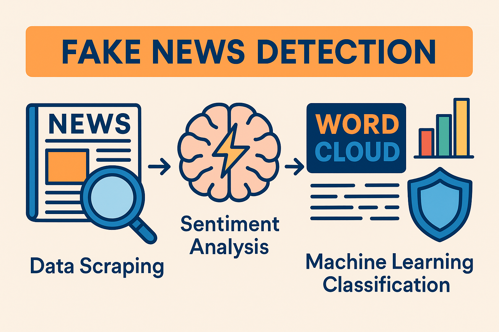
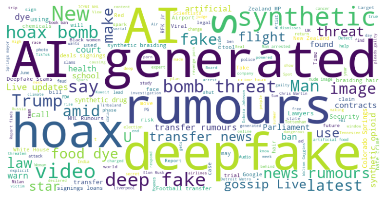
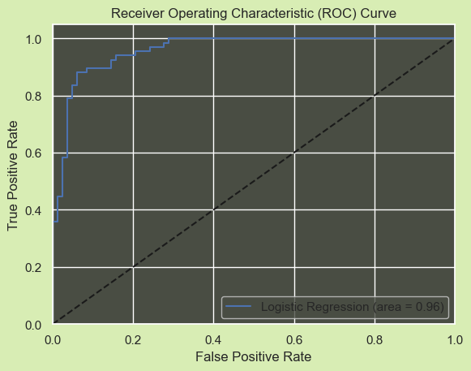
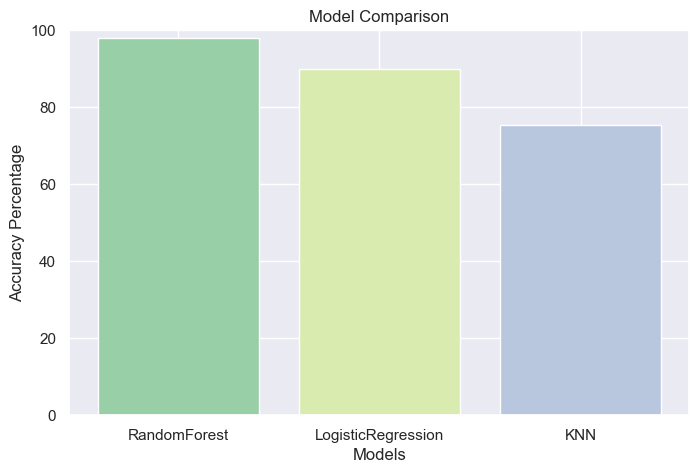
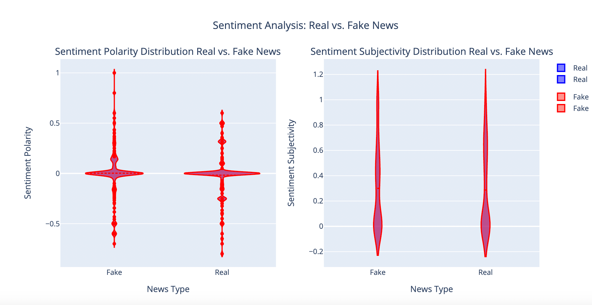
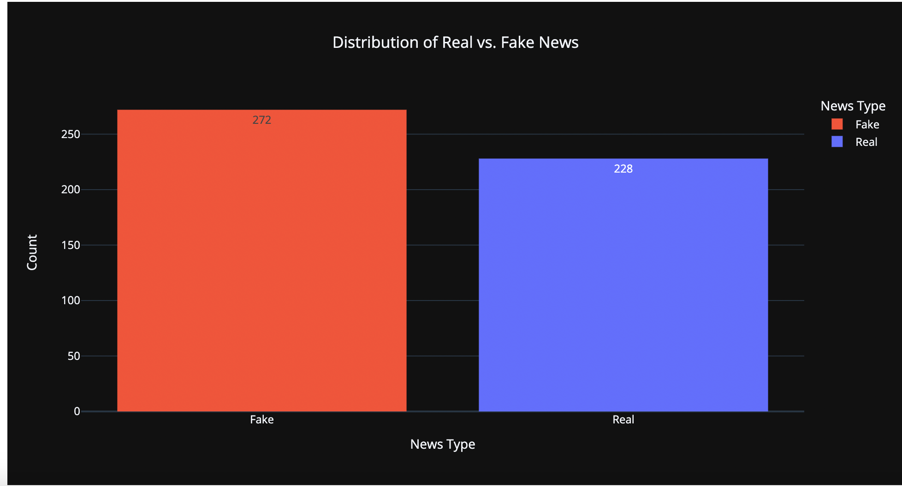

# Fake_News-Detection_Sentiment_Analytics
Python end-to-end pipeline for scraping, cleaning and analysing misinformation in online news

## 🚩 Problem statement
Deep-fake imagery, click-bait headlines and AI-generated articles have blurred the line between reliable and fabricated news. Current platforms need scalable, transparent ways to surface signals of misinformation and protect audience trust.

## 🎯 Project objectives
Collect a recent corpus of news headlines covering fake-news-related keywords.

Pre-process & enrich text with sentiment scores and TF-IDF features.

Visualise dominant terms (word cloud) and sentiment distribution.

Prototype ML workflows (K-Means topic grouping, baseline classifiers) to flag suspicious articles.

Produce actionable insights & recommendations for platform owners and researchers.

## 1 . Data pipeline
| Stage                    | Key steps                                                     | Output                                 |
| ------------------------ | ------------------------------------------------------------- | -------------------------------------- |
| **Web scraping**         | `BeautifulSoup` + Google News RSS; loops daily keywords       | `raw_google_news.csv`                  |
| **Merge & clean**        | Drop duplicates, normalise Unicode, punctuation, stop-words   | `merged_google_news.csv`               |
| **Feature engineering**  | Text length, uppercase ratio, TF-IDF, sentiment with TextBlob | Data-frame with 30+ engineered columns |
| **Exploratory analysis** | Word-cloud, bar-plots, violin plots for polarity/subjectivity | `figures/…`                            |
| **Clustering / ML**      | K-Means (elbow≈4), logistic-reg. baseline, ROC/AUC demo       | Pickled model + metrics                |

### EDA outputs
| Word cloud | ROC-AUC curve |
|------------|---------------|
|  |  |

### Machine Learning Model Comparision and Precision
| Model Comparision | Model Precision |
|------------|---------------|
|  |  |

## 2 . Highlights & findings
Prevalence gap – Fake-tagged headlines out-number verified ones roughly 3 : 1, underscoring platform exposure risk.

Sentiment skew – Fake stories lean toward extreme polarity (very positive or very negative) while real news remains centred.

Keyword hotspots – Frequent terms include “claim”, “viral”, “deepfake”, “exposed”, “hoax”—useful for heuristic filters.

Temporal bursts – Peaks in headline volume coincide with major geopolitical events; suggests value in time-aware models.

### Analysis
| Sentiment Analysis | Real Vs Fake News |
|------------|---------------|
|  |  |

## 3 . Recommendations
Dynamic sentiment thresholds – Flag headlines whose polarity deviates > 2 σ from the rolling weekly mean.

Time-sensitive retraining – Refresh models every 30 days to capture evolving disinformation tactics.

Genre-specific fine-tuning – Separate pipelines for politics, health, finance to reduce false positives.

User education banners – Summarise detected sentiment & credibility score beside headlines to nudge critical reading.

## 4 . How to reproduce
jupyter notebook Fake_New_Project.ipynb  # or run_all.sh

## 5 . 🛠  Tech stack
| Layer | Technology |
|-------|------------|
| Language | **Python 3.11** |
| Core libs | `BeautifulSoup4`, `requests`, `pandas`, `numpy` |
| NLP | `scikit-learn`, `TextBlob`, `NLTK` |
| Visuals | `matplotlib`, `seaborn`, `wordcloud` |
| CI / CD | GitHub Actions |
| Packaging | `conda`, `pip-tools` |

## References
Balshetwar, S.V., RS, A. and R, D.J. (2023). Fake news detection in social media based on sentiment analysis using classifier techniques. Multimedia Tools and Applications. doi:https://doi.org/10.1007/s11042-023-14883-3.

Uzun, E. (2020). A Novel Web Scraping Approach Using the Additional Information Obtained From Web Pages. IEEE Access, 8, pp.61726–61740. doi:https://doi.org/10.1109/access.2020.2984503.

Kho, E. (2023). 'Fake news detection algorithm with Python'. Medium. Available at: https://medium.com/@ethanrkho/fake-news-detection-algorithm-with-python-f7267e3d5d2e [5th April, 2024]. Uzun, E. (2020). A Novel Web Scraping Approach Using the Additional Information Obtained From Web Pages. IEEE Access, 8, pp.61726–61740. doi:https://doi.org/10.1109/access.2020.2984503.

Mitchell, R.E. (2018). Web scraping with Python : collecting more data from the modern web. Sebastopol, Ca: O’reilly Media.
